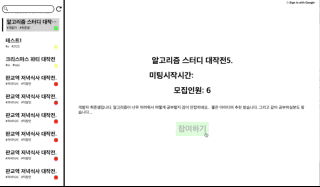

# 404 Idea Not Found

[](https://app.netlify.com/sites/agitated-thompson-bc98e2/deploys)


- deploy: https://www.404-idea-not-found.com/

## 📎 프로젝트 기획

---

부트캠프 개인 프로젝트 기간이 되었는데 계속해서 무엇을 만들어야할지 아이디어가 생각나지 않았습니다. 뭔가 기발하고 독창적인것을 만들어야겠다는 목표는 있었지만 무엇이 좋을지 머리를 쥐어싸고 고민해봐도 아무런 결정을 내리지 못했습니다... 프로젝트 아이디어 모집 기간이 단 3일 남았을떄 까지도 계속 결정을 못하다가 떠올렸습니다.

<span style="color:red; font-weight: bold; font-size: 1.5rem">아이디어가 없는게 아이디어다!</span>

특정 주제에 대해 막연한 목표는 갖고 있지만 해당 목표를 혼자서 구체화 하는 것은 많은 사람들이 어려워 하는 부분이라고 생각했습니다.

혼자서 하기 어렵다면 다른 사람들과 같이 의견을 나누며 브레인 스토밍 할 수 있는 공간이 있으면 좋겠다 생각했고. 404 Idea Not Found 프로젝트를 시작하게 되었습니다.

## 🕹 주요기능

---



- 원하는 시간을 선택해서 미팅을 개설할 수 있습니다.
- 참가를 원하는 미팅을 예약 하면 미팅 시작 시간에 자동으로 이메일이 보내집니다.
- 개설한 미팅에 참여해 미팅주최자의 스트리밍을 보며 채팅에 참여할 수 있습니다.
- 그리기 요청을 보내서 화이트 보드에 같이 그림을 그릴 수 있습니다.
- 동료가 되기 버튼을 눌러서 프로젝트 임원으로 참여 할 수 있습니다.

## 📆 프로젝트 기간

---

총 기간 3주 (2022-02-21~2022-03-13)

<strong>기획</strong>

- 1주차: 2022-02-21 ~ 2022-02-27
  - [기술검증](https://www.notion.so/ede18fbb4a604958ba9a01d7e4c00464)
  - [목업작성](https://www.figma.com/file/STc6ILUnZd9v3RGLhuyVNz/404-Idea-Not-Found?node-id=0%3A1)

<strong>개발</strong>

- 2주차: 2022-02-28 ~ 2022-03-06
  - 공통 컴포넌트 구성
  - 라우트 작업
  - 소켓통신 작업
  - 메일서버 작업
- 3주차 : 2022-03-07 ~ 2022-03-13
  - WebRTC 구현
  - 테스트코드 작성
  - 배포
  - 디버깅

## 📤 로컬환경 실행

---

1. 프론트엔드 / 백엔드 서버 / 이메일 워커서버 3개가 전부 로컬에서 실행되고 있어야 정상 작동합니다.
2. 루트 디렉토리에 있는 .env.sample에 맞춰서 .env 파일을 생성후 해당 파일에서 환경변수를 설정 해주셔야 정상작동합니다.

<strong>Frontend</strong>

```
npm install
npm start
```

<strong>Backend & EmailServer</strong>

```
npm install
npm run dev
```

<strong>Testing (front/back/email)</strong>

```
npm test
```

## 📦 배포

---

Frontend - [Netlify](https://www.404-idea-not-found.com/main)  
Backend - AWS Elastic Beanstalk

## 🧩 Challenges

---

- 비동기 로직

  - Redux-Saga  
    이번 프로젝트 이전까지 작성했던 코드들은 redux thunk를 이용해서 비동기 통신 로직을 분리해 주거나 useEffect를 이용해 side effect 로직을 컴포넌트 내부에서 관리했습니다.

    Side effect가 단순할 때는 컴포넌트 내부에서 같이 뷰로직과 side effect 로직을 관리하는 게 코드의 응집도가 높아 편했지만 단순 Request, Response 2가지가 이닌 소켓통신과 같은 세세한 이벤트별로 처리가 필요할 경우 **뷰 렌더링 로직과 비동기 통신 로직이 혼재되어 통재가 어려울 것**으로 예상했습니다.

    따라서 더 세세한 side effect 관리를 위한 방법들을 찾다가 npm다운로드수가 가장 많고 현업에서도 많이 쓰인다고하는 Redux Saga를 선택하고 적용해 봤습니다.

    평소 제너레이터 문법을 경험해 본 적이 없어서 초반에 saga의 작동 방식을 이해하는 데 어려움을 겪었습니다. 공식 문서와 여러 자료를 읽어가며 Saga가 결국 yield를 통해 이터레이터를 반환하는 방식으로 함수 실행을 일시 정지 시킨다는 점, 그리고 Saga의 fork가 Nodejs에서 child process를 통해 별도의 작업을 병렬로 처리하는 방식과 비슷하다는 점을 캐치하니 Saga의 작업 방식이 이해가 되었습니다.

    그러나 무언가를 이해하는 것과 현실에 적용하는 것은 서로 다른 일이지요. 소켓로직을 Saga의 이벤트 채널로 분리해줄때 과연 어디서 fork를 해줘야 할 지, 생성되는 socket 객체는 어디서 관리해야 할지, simple peer를 통한 WebRTC 로직은 어떻게 flow를 작성할지의 문제로 계속 전반적인 앱 구조를 고민하고 관심사를 최대한 분리하며 구현했습니다.

    Saga를 통해 비동기를 관리하니 확실히 thunk나 useEffect보다 비동기 로직의 분기에 따른 결과를 세세하게 관리할 수 있어 좋았습니다. 테스트 코드에서 자세한 api의 모킹을 하지않고 yield되는 effect들만 검사 해주면되는 점 또한 장점이라 생각합니다.

    그러나 Saga를 이용하게 되면서 작성해 줘야 되는 **보일러 플레이트 코드가 많아져 생산성이 떨어지는 부분**은 아쉽다고 느껴졌습니다. 또한 팀 단위로 Saga를 도입한다면 초반에 어느 정도 러닝 커브를 염두 해야 할 것 같습니다. 프로젝트 중간에 react query를 알게되어 잠깐 시도해봤는데 Saga에 비해 훨씬 로직이 간결한 느낌이었습니다. 다음에는 react query를 이용해 비동기 로직을 관리해보려합니다.

- WebRTC

  - 본래 404 Idea Not Found 프로젝트의 미팅기능 기획은 미팅 주최자와 미팅 참여자의 양방향 통신이었습니다. 그러나 WebRTC의 경우 중앙에 별도의 미디어 서버가 없을 경우 연결되는 미팅 주최자 1명당 계속 peer 커넥션이 늘어나는 mesh 방식으로 구현해야 되었습니다. Mesh 방식은 한 개의 미팅당 총 연결되는 커넥션의 수가 n(n-1)/2 가 되며 대역폭과 성능을 너무 잡아먹어 **특정 유저의 연결이 멈춰버리는 현상이 발생** 할 것으로 예상되었습니다. 따라서 미팅 주최자가 단독으로 스트리밍을 하는 방식으로 선회해야 했습니다.

    또한 현재 미팅이 종료시 Peer를 destroy할때 Peer 커넥션과 media 스트림이 graceful 하게 종료 되도록 해결 하지 못했습니다. 개인적인 예상으로 peer를 destroy
